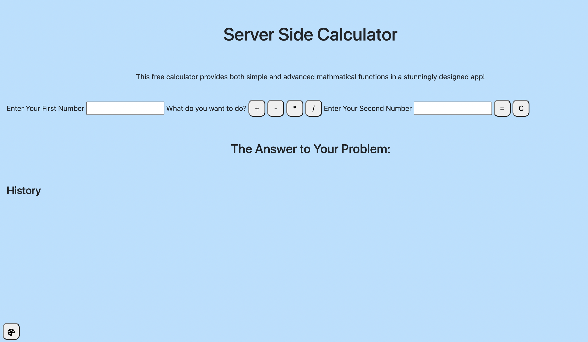

# Server Side Calculator

## Description

_Duration: 2 Day Sprint_

A simple mathmatical calculator with the option to customize your background coloring.

To see the fully functional site, please visit: [DEPLOYED VERSION OF APP](https://mmettille-jquery-calculator.herokuapp.com/)

## Screen Shot

### Prerequisites

- [Node.js](https://nodejs.org/en/)
- Express
- Body Parser

## Usage

1. User inputs first number
2. User inputs what operator they'd like to use
3. User inputs second number
4. User presses the '=' button, which will calculate the problem for them!
5. OPTIONAL Background Color Functionality:
    - User clicks the paint button in the bottom left hand corner
    - User clicks which color they would like for their background
    - User clicks save changes button.

## Built With

- HTML 5
- CSS 3
- Javascript
- jQuery
- node.js
- Bootstrap

## Acknowledgement
Thanks to [Prime Digital Academy](www.primeacademy.io) who equipped and helped me to make this application a reality. A huge shoutout to Dane, my instructor, you taught me so much! And to my co-parent, Isaac - thank you for all that you do for me and for our family! You've picked up a lot of responsibility while I was at Prime and that has not gone unnoticed.

## Support
If you have suggestions or issues, please email me at [mary.mettille.brist@gmial.com].
